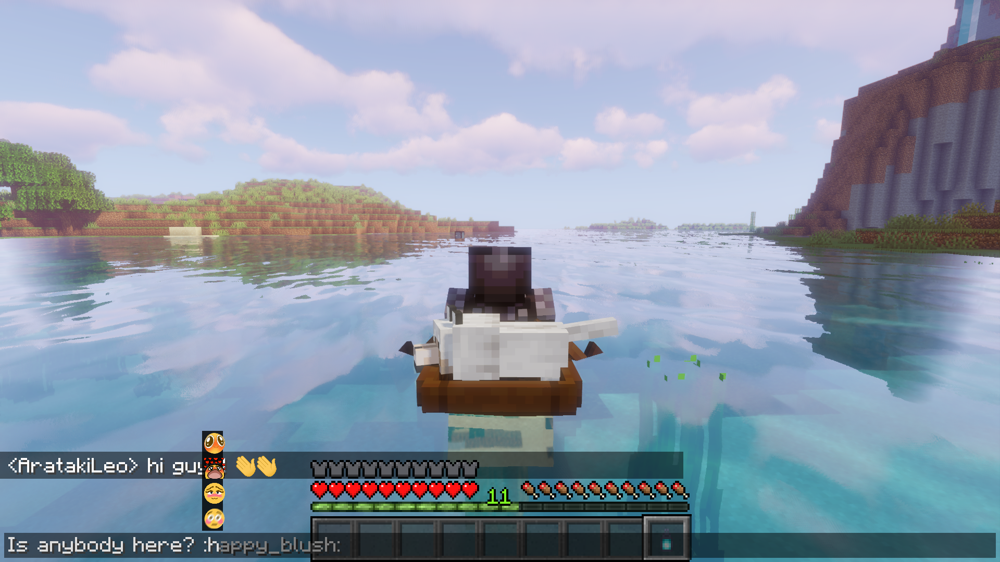
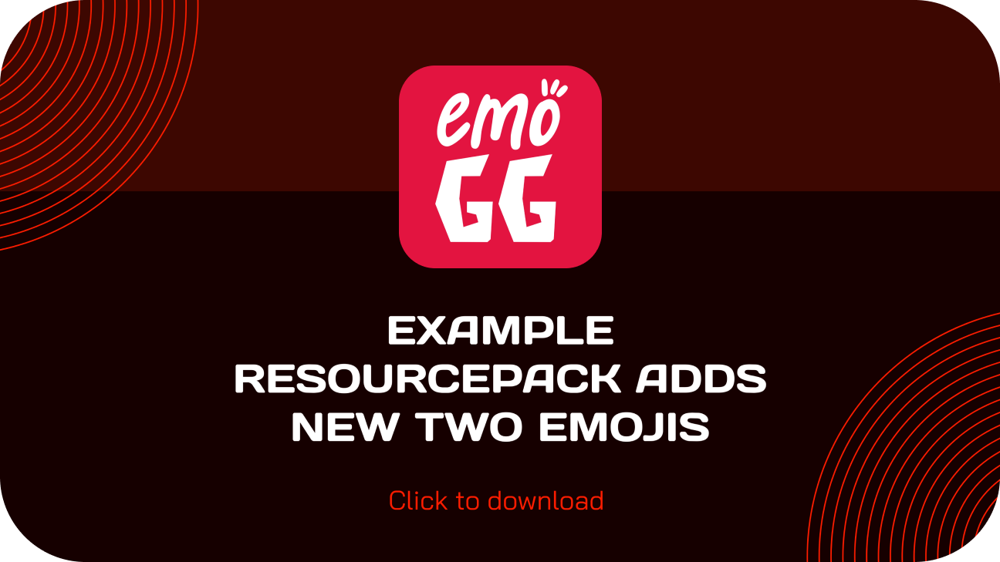
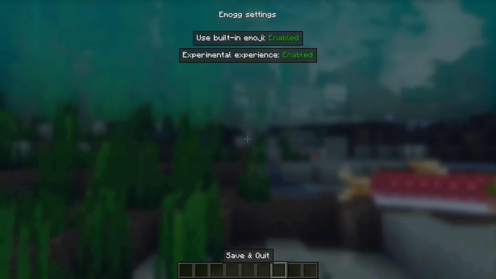

# Emogg for better chatting experienсe! [1.17+] 
Adds emoji support to the chat and to most of the Minecraft interface. Emoji are specified in the format: `:emoji_name:`

### Features
- when you enter emojis, hints appear in the form of the most appropriate emoji names

- you can use the emoji selection menu to choose one (only for chat interface)

- add new emoji by resourcepacks (just insert your images to `assets/emogg/emoji/`)
- support for both static (`.png`) and animated (`.gif`) emojis

- when playing on the server with this mod, other players on the server who do not have this mod, or do not have emoji resource packs that you have, will see `:emoji_name:` instead of emoji
- you can disable built-in emojis (they will not be displayed when you enter the emoji name and in the emoji selection menu)

- you can escape emoji code with backslash before it `\:emoji_name:`
