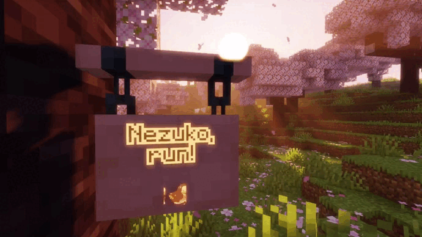

# Emogg for better chatting experienсe! 
Adds emoji support to the chat and to most of the Minecraft interface!

### Features
- support for both static and animated emojis
- ease of adding your own emojis. Just create a texture pack, add pictures there along the way `assets/emogg/emoji`, add a resource pack to the game - done!
- you can use emojis in chat, on signs and in other places where there is text!
- when you enter the emoji name, emoji suggestions appear above the input field (available only for chat)
- you can choose the emoji you like in the emoji selection menu! (available only for chat)
- by default, two emoji texture packs are built into the mod at once, each of which you can disable through the resource pack selection menu, like a regular resource pack

### How do emojis work?
To use emoji, you need to type `:emoji_name:`. If you do this in a chat, you will be shown autocompletion hints. The emoji selection menu is also available in the chat, which opens by clicking on the button in the lower right corner.

If you play on the server or over the network, then in addition to the fact that you and other players must have this mod installed, everyone must have the same resource packs added. If any of these conditions are not met, then instead of emojis, other players will see `:emoji_name:`.

If you don't want the emoji name to be transformed into an emoji, you can escape the emoji name by putting a backslash in front of it, thus: `\:emoji_name:`.

### How can I add my own emojis?
Next, the `assets/emogg/emoji` directory of the resource pack will be designated as the main directory or the main folder of the resource pack.

To add your emojis to the game, just add pictures in the format `.gif` or `.png` to the main directory inside your resource pack. Each picture added in this way will be automatically added to the game as an emoji.

The optimal resolution for each emoji will be approximately `128x128` pixels. There is not much point in a higher resolution. Emoji will look better in the game if there is not too much empty space between the edges of the picture and the content. It is better to avoid adding emojis with too small details, because they can be difficult to distinguish.

The name of the image file, without extension, will be used as the name of the emoji, which can consist only of lowercase Latin characters `a-z`, numbers `0-9`, underscores `_`. Moreover, the underscores cannot stand at the beginning or at the end of the emoji name. The name of the image file can be anything, however, when loading emojis, all names are modified as follows:
- all spaces, dots and dashes will be replaced with underscores
- the underscores at the beginning and at the end of the name will be removed
- unsupported characters will be removed from the name
- uppercase Latin characters will be converted to lowercase characters

The same rules apply to the names of the categories in which your emojis will be listed. By default, all emojis added to the main catalog will be listed in the `other` category. To link your emojis to a certain category, it is enough to create a folder with the name of the category inside the main folder and transfer there the emojis that will be attributed to this category. There can be any number of folders with any name between the main folder and the category folder, because the name of the pack in which your emojis are directly located (except the main folder) will be taken as the name of the category. This can be used to create a namespace. So if another resource pack has an emoji with the same name as yours, both your and the emoji from another resource pack will be added to the game.

By default, the following category names are already registered in the mod:
- `anime`
- `memes`
- `people`
- `nature`
- `food`
- `activities`
- `travel`
- `objects`
- `symbols`
- `flags`
- `other`

You can add your emojis to these categories or create your own. Also, for these categories, translation into four languages has already been implemented: English, German, Chinese, Ukrainian, Russian. You can [help with translating](https://github.com/aratakileo/emogg/tree/main/src/main/resources/assets/emogg/lang) the mod into other languages. If you don't add a translation for your new categories using the resource pack language files, the folder name with a capital letter will be used. To add a translation of your category, you need to use the translation key `emogg.category.your_category_name`, where it is necessary to replace `your_category_name` with the name of your category. Each new category you add will be displayed in the selection menu above those already built into the mod.

If the mod detects two or more emojis with the same name, these emojis will be added to the game, but the names of such emojis will be modified. At the end of the name of such emojis, an ordinal number will be added to distinguish them.

You can find more detailed information on how to create your own resource packs on the Internet, or you can [download one](https://github.com/aratakileo/emogg/raw/main/resourcepack/builtin.zip) of the resource packs built into the mod as an example.
