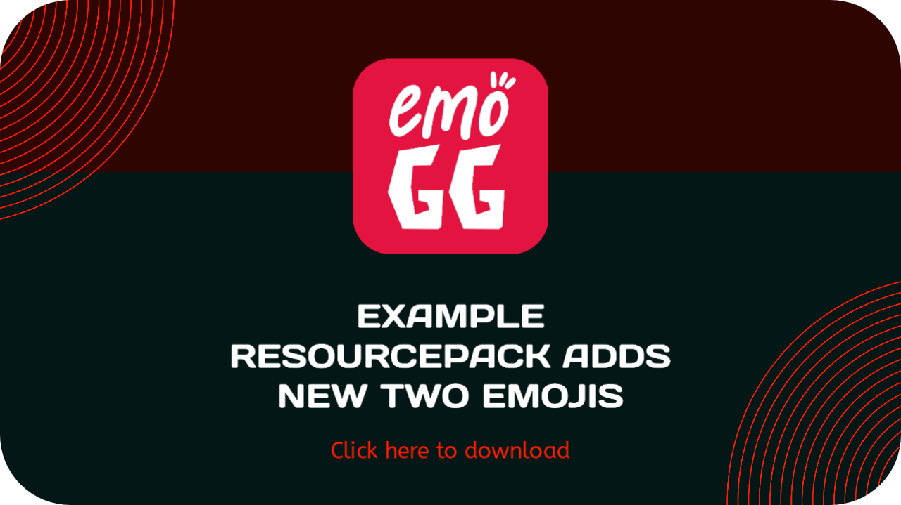

# Emogg for better chatting experienсe! [1.17+] 
Adds emoji support to the chat and to most of the Minecraft interface.
Emoji are specified in the format: `:emoji_name:`

### Features
- add new emoji by texture pack (just insert your images to `assets/emogg/emoji/`)
- when you enter emojis, hints appear in the form of the most appropriate emoji names
- support for both static (`.png`) and animated (`.gif`) emojis

